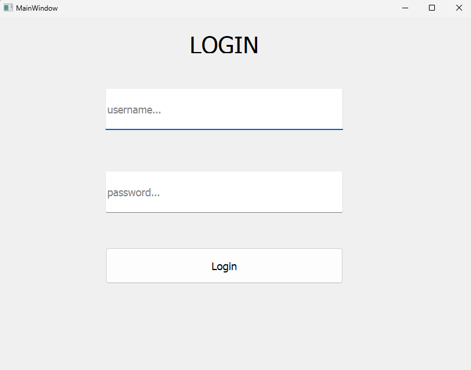

# 🔐 How to Create a Secure Login System in Pyqt5



This is a simple, secure, and beginner-friendly Python login system built with Pyqt5, QtDesigner and MySQL.
Created by [HeroSolve Dev.](https://www.youtube.com/@herosolvdev) as part of a hands-on tutorial.

> ✅ Ideal for beginners who want to learn how user authentication works using QtDesigner and Pyqt5.

---

## ✨ Features

- ✅ Design a GUI using QtDesigner
- ✅ Convert .ui files to Python
- ✅ Creating a working login system with username and password
- ✅ Using MySQL to store and verify user credentials

---

## Technologies Used
- Python
- Pyqt5
- QtDesigner
- MySQL
- Wampserver

---

## 🚀 Installation

1. Clone the repository:
```bash
    git clone https://github.com/Amine4jh/pyqt5_simple_login
```
2. Open login.py and update your database credentials (host, DB name, user, and password).
3. Run the project.

---

## 📝 License & Usage

- You can freely use this project for learning or as a base for your own systems.
- Do not sell it as-is or redistribute it without modifications.

---

## 📢 Credits

- Built with 💻 by [HeroSolve Dev.](https://www.youtube.com/@herosolvdev)
- Subscribe on YouTube for full tutorials, real-world projects, and beginner-friendly dev content.
